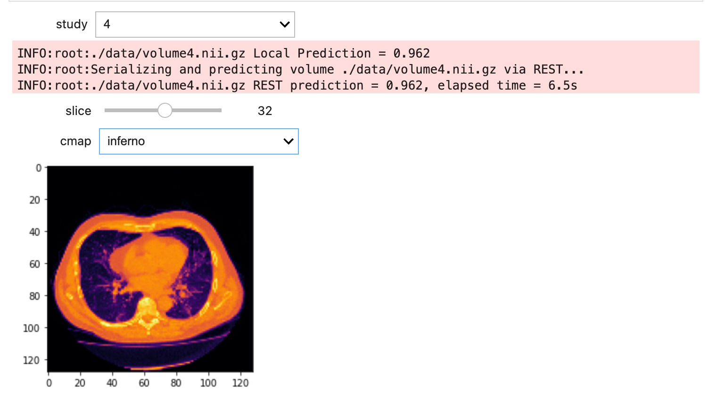

# Classification of Pneumonia using 3D CT Images 

This page is currently being updated and likely contains errata (8/29/2022)



Based on work by [Hasib Zunair](https://keras.io/examples/vision/3D_image_classification/)

## Tested Environment
### OpenDataHub (ODH) v1.3
### Openshift Container Platform (OCP) v4.10.26


### Server side configuration

0) Change to the `resources` directory.
```
cd 3d-image-classification/resources
```

1) Create a project called `ml-mon`
```
oc new-project ml-mon
```

2) Using the Openshift console, install the Seldon Core, Prometheus and Grafana community operators
from OperatorHub in the `ml-mon` namespace.

3) Create an instance of Prometheus and Grafana in the `ml-mon` namespace.

```
oc get pods -n ml-mon -w
```
```
NAME                                   READY   STATUS    RESTARTS   AGE
$ oc get pods -n ml-mon             

NAME                                                   READY   STATUS    RESTARTS   AGE
grafana-deployment-8fbf7c944-7895m                     1/1     Running   0          5h35m
grafana-operator-controller-manager-6ff698d9fc-xvk28   2/2     Running   0          5h35m
prometheus-example-0                                   2/2     Running   0          5h35m
prometheus-operator-7b9ccd45c6-7v8td                   1/1     Running   0          5h35m
```


4) Create a Prometheus Service Monitor 
5) Login to the Grafana console. The username and password can be obtained from the
`grafana-admin-credentials` secret.
6) Within Grafana, configure a Prometheus data source
7) Import the Seldon dashboard from the `resources/seldon-dashboard.json` file.

```
oc create -f 04-grafana-prometheus-datasource.yaml             
oc create -f 05-prediction-analytics-seldon-core-1.2.2.yaml
oc create -f 06-seldon-mymodel-servicemonitor.yaml
```

7) Deploy and wait for the Seldon classifier pod to become ready. Two services should be created by the Seldon deployer.
```
oc create -f 07-mymodel-seldon-deploy-from-quay.yaml
```

```
oc get pods
```
```
NAME                                            READY   STATUS    RESTARTS   AGE
mymodel-mygroup-0-classifier-57647887d9-98qqb   2/2     Running   0          118s
```
```
oc get services
```
```
NAME                         TYPE        CLUSTER-IP     EXTERNAL-IP   PORT(S)             AGE
mymodel-mygroup              ClusterIP   10.217.5.143   <none>        8000/TCP,5001/TCP   20s
mymodel-mygroup-classifier   ClusterIP   10.217.4.127   <none>        9000/TCP            2m4s
```

8) Create a route for the Seldon model server.
```
oc create -f 08-mymodel-route.yaml
```

Curl the prometheus endpoint and confirm it is able to scrape metrics from the classifier pod.
```
curl -X GET $(oc get route mymodel-mygroup -o jsonpath='{.spec.host}')/prometheus
```
```
...
promhttp_metric_handler_requests_total{code="200"} 5
```

### OpenDataHub and Jupyter Client Configuration

Jupyter Notebook dependencies

```  
pip install tensorflow jupyterlab ipywidgets scipy
```

- Login to OpenDataHub on the [Massachusetts Open Cloud](https://odh.operate-first.cloud/) and launch JupyterHub.
- Start the JupyterHub server and choose the `Standard Data Science` notebook image.
- Create a terminal
- Clone this github repo
- Run the `01-inference-3d-image-classification` notebook.
- Find the notebook cell with `predict` function and modify the `url` variable to point to the route that was created.
  - `echo $(oc get route mymodel-mygroup -o jsonpath='{.spec.host}')/api/v1.0/predictions`
- Run the notebook and select a study to make a few predictions to trigger Seldon activity.

Within 30 seconds or so there should be Seldon entries in the Prometheus database.

```
curl -X GET $(oc get route mymodel-mygroup -o jsonpath='{.spec.host}')/prometheus
```
```
seldon_api_executor_server_requests_seconds_sum{code="200",deployment_name="mymodel",method="post",predictor_name="mygroup",predictor_version="",service="predictions"} 4.714845908
seldon_api_executor_server_requests_seconds_count{code="200",deployment_name="mymodel",method="post",predictor_name="mygroup",predictor_version="",service="predictions"} 5
```

#### Install the Prometheus operator community operator

Deploy an instance in this namespace.

#### Do the same for Grafana

[Configure Grafana to use the built-in Prometheus Data Source](https://www.redhat.com/en/blog/custom-grafana-dashboards-red-hat-openshift-container-platform-4)
so a GPU dashboard can be created.

Import the Seldon and [GPU](https://grafana.com/grafana/dashboards/12239-nvidia-dcgm-exporter-dashboard/) dashboards from the included json files.

Follow

Open The Prometheus and Grafana Dashboards to visualize the API activity.


## Developer Notes

#### Building the Seldon deployer container image using OpenShift's s2i workflow.

#### Create and start a new build.

```
cd 3d-image-classification

oc new-build --strategy docker --docker-image registry.redhat.io/ubi8/python-36 --name mymodel -l app=mymodel --binary

oc start-build mymodel --from-dir=. --follow
```
```
oc get is

NAME      IMAGE REPOSITORY                                                     TAGS     UPDATED
mymodel   image-registry.openshift-image-registry.svc:5000/bk-models/mymodel   latest   7 seconds ago
```

Edit `mymodel-seldon-deploy.yaml` to confirm that the image location matches what the image stream reports. Then deploy the model server and wait for the pod to become ready.

```
oc apply -f resources/mymodel-seldon-deploy.yaml
```
```
oc get pods

NAME                                            READY   STATUS              RESTARTS   AGE
mymodel-mygroup-0-classifier-7c6b44569c-qmzk6   2/2     Running             0          61s
```

Expose the service
```
oc expose svc <svc-name>
```

To trigger a redeploy after a new build. This does not always work so the pod may have to be deleted.

```
oc patch deployment <deployment-name> -p "{\"spec\": {\"template\": {\"metadata\": { \"labels\": {  \"redeploy\": \"$(date +%s)\"}}}}}"
```

### Trouble Shooting

```
$ oc create -f resources/07-mymodel-seldon-deploy-from-quay.yaml
Error from server (InternalError): error when creating "resources/07-mymodel-seldon-deploy-from-quay.yaml": Internal error occurred: failed calling webhook "v1.vseldondeployment.kb.io": Post "https://seldon-webhook-service.odh.svc:443/validate-machinelearning-seldon-io-v1-seldondeployment?timeout=30s": service "seldon-webhook-service" not found
```

This can happen after ODH has been re-installed into a different project. To fix it delete the old webhook.

```
oc get MutatingWebhookConfiguration,ValidatingWebhookConfiguration -A

oc delete validatingwebhookconfiguration.admissionregistration.k8s.io/seldon-validating-webhook-configuration-odh
```

