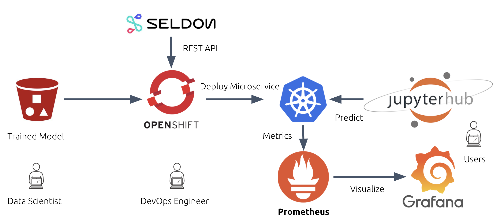
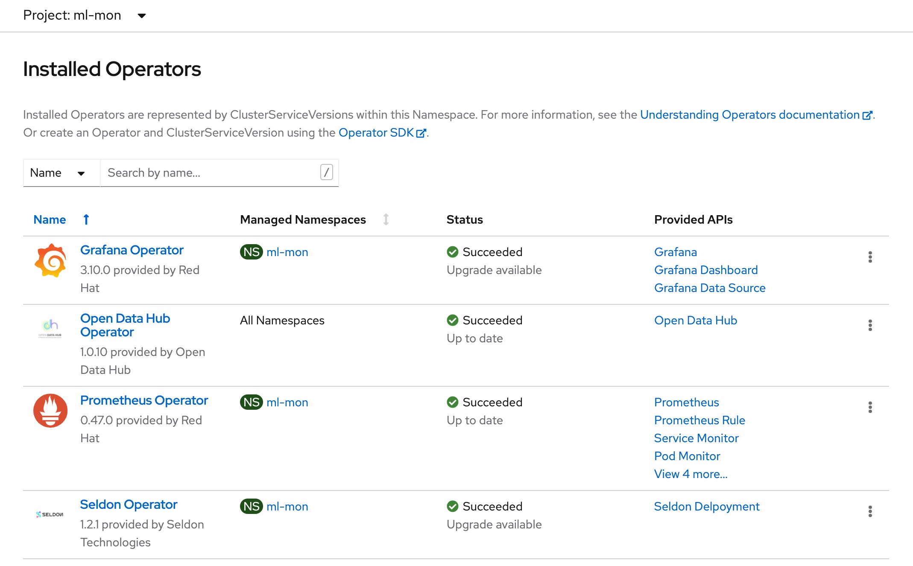
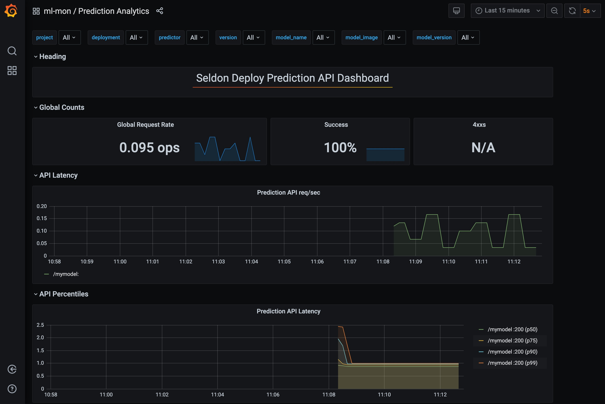

# Classification of 3D Medical images 

Based on work by [Hasib Zunair](https://keras.io/examples/vision/3D_image_classification/)

## A machine learning demo using OpenDataHub (ODH) and the OpenShift Container Platform (OCP)



### Server side configuration

Login to the [OpenShift Learning Portal](https://learn.openshift.com). Near the the bottom of the page, choose **OpenShift Playgrounds** -> **OpenShift 4.7 Playground**.

Choose **Start Scenario** and perform the following steps using the command line interface.

0) Clone this repo.
```
git clone https://github.com/bkoz/3d-image-classification
cd 3d-image-classification/resources
```

1) Create a project called `ml-mon`
```
oc new-project ml-mon
```

2) Deploy the ODH operator and wait for it to become ready.
```
oc create -f 02-odh-operator-subscription.yaml
```
```
oc get pods -n openshift-operators
```
```
NAME                                   READY   STATUS    RESTARTS   AGE
opendatahub-operator-5b6cb986d-48zxr   1/1     Running   0          3m22s
```

3) Deploy the ODH kfdef and wait for all of the pods shown below to become ready. This could take 10 minutes or more to complete. It may be helpful
to open the OpenShift console to monitor the installation status of the operators.

```
oc create -f 03-opendatahub-kfdef-seldon-prometheus-grafana.yaml
```
```
oc get pods
```
```
grafana-deployment-5f6949bc8-ww97f              1/1     Running   0          7m10s
grafana-operator-cd65d6644-79mhv                1/1     Running   0          7m39s
odh-dashboard-764cbcb544-n8ff6                  1/1     Running   0          16m
odh-dashboard-764cbcb544-qfhkk                  1/1     Running   0          16m
prometheus-odh-monitoring-0                     2/2     Running   1          3m12s
prometheus-odh-monitoring-1                     2/2     Running   1          3m11s
prometheus-operator-578ccd6c45-dmfbg            1/1     Running   0          3m21s
seldon-controller-manager-6d5d5d4d8-9pfhx       1/1     Running   0          7m37s
```



4) Configure Prometheus
5) Configure Grafana
6) Create a Service Monitor 
```
oc create -f 04-grafana-prometheus-datasource.yaml             
oc create -f 05-prediction-analytics-seldon-core-1.2.2.yaml
oc create -f 06-seldon-mymodel-servicemonitor.yaml
```

7) Deploy and wait for the classifier pod to become ready. Two services should be created by the Seldon deployer.
```
oc create -f 07-mymodel-seldon-deploy-from-quay.yaml
```

```
oc get pods
```
```
NAME                                            READY   STATUS    RESTARTS   AGE
mymodel-mygroup-0-classifier-57647887d9-98qqb   2/2     Running   0          118s
```
```
oc get services
```
```
NAME                         TYPE        CLUSTER-IP     EXTERNAL-IP   PORT(S)             AGE
mymodel-mygroup              ClusterIP   10.217.5.143   <none>        8000/TCP,5001/TCP   20s
mymodel-mygroup-classifier   ClusterIP   10.217.4.127   <none>        9000/TCP            2m4s
```

8) Create the route.
```
oc create -f 08-mymodel-route.yaml
```

Curl the prometheus endpoint and confirm it is able to scrape metrics from the classifier pod.
```
curl -X GET $(oc get route mymodel-mygroup -o jsonpath='{.spec.host}')/prometheus
```
```
...
promhttp_metric_handler_requests_total{code="200"} 5
```

### Client Configuration

- Login to OpenDataHub on the [Massachusetts Open Cloud](https://odh.operate-first.cloud/) and launch JupyterHub.
- Start the JupyterHub server using the `s2i-generic-data-science` notebook image.
- Create a terminal
- Clone this github repo
- Run the `01-inference-3d-image-classification` notebook.
- Find the notebook cell with `predict` function and modify the `url` variable to point to the route that was created.
  - `echo $(oc get route mymodel-mygroup -o jsonpath='{.spec.host}')/api/v1.0/predictions`
- Run the notebook and select a study to make a few predictions to trigger Seldon activity.

Within 30 seconds or so there should be Seldon entries in the Prometheus database.

```
curl -X GET $(oc get route mymodel-mygroup -o jsonpath='{.spec.host}')/prometheus
```
```
seldon_api_executor_server_requests_seconds_sum{code="200",deployment_name="mymodel",method="post",predictor_name="mygroup",predictor_version="",service="predictions"} 4.714845908
seldon_api_executor_server_requests_seconds_count{code="200",deployment_name="mymodel",method="post",predictor_name="mygroup",predictor_version="",service="predictions"} 5
```

Open The Prometheus and Grafana Dashboards to visualize the API activity.



## Developer Notes

#### Building the Seldon deployer container image using OpenShift's s2i workflow.

#### Create and start a new build.

```
cd 3d-image-classification

oc new-build --strategy docker --docker-image registry.redhat.io/ubi8/python-36 --name mymodel -l app=mymodel --binary

oc start-build mymodel --from-dir=. --follow
```

Edit `mymodel-seldon-deploy.yaml` to match the environment and deploy.

```
oc apply -f resources/mymodel-seldon-deploy.yaml

oc expose svc <svc-name>
```

To trigger a redeploy after a new build. This does not always work so the pod may have to be deleted.

```
oc patch deployment <deployment-name> -p "{\"spec\": {\"template\": {\"metadata\": { \"labels\": {  \"redeploy\": \"$(date +%s)\"}}}}}"
```


